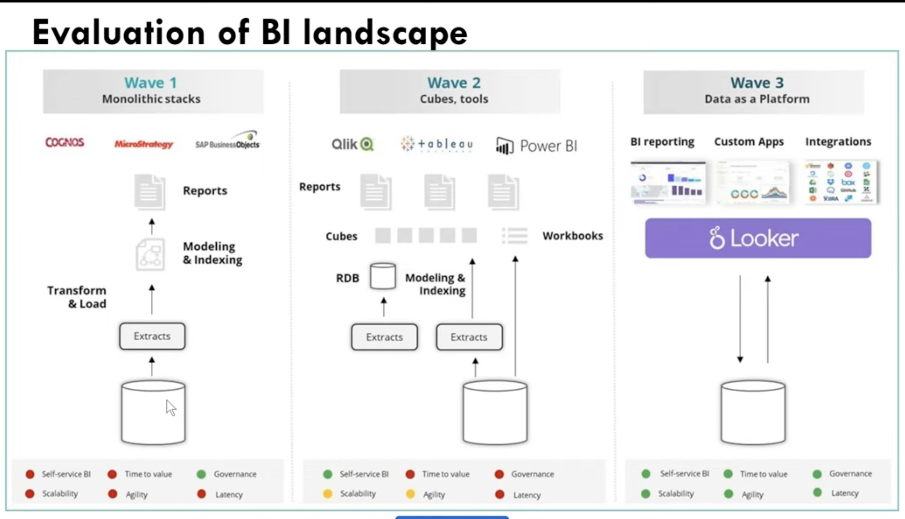
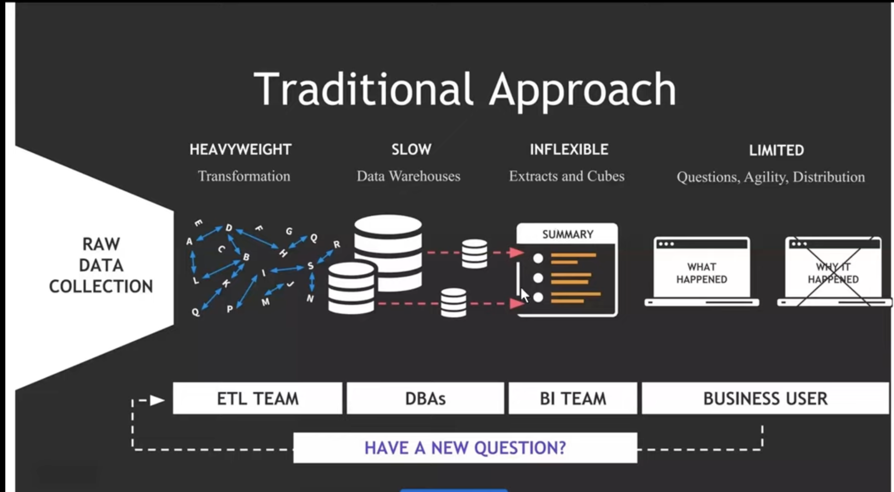
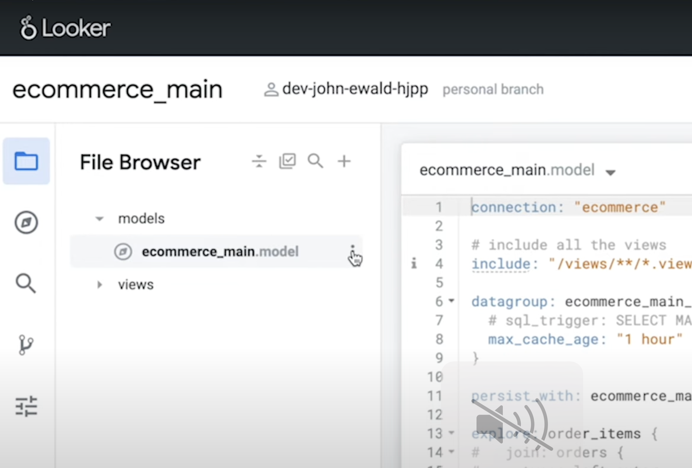
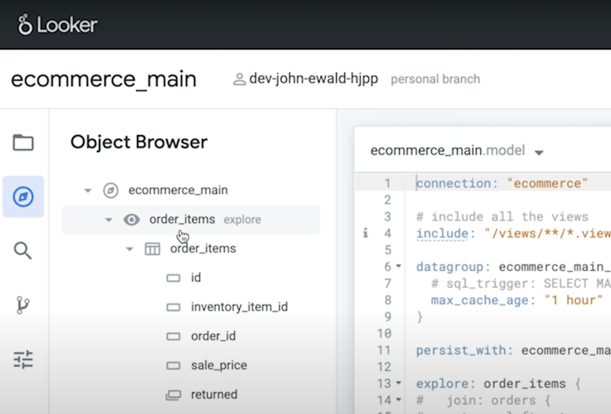

# Looker
Looker is an enterprise platform for BI, data applications, and embedded analytics that helps you explore and share insights in real time.

Looker Data Sciences, Inc. is an American computer software company headquartered in Santa Cruz, California. It was acquired by Google in 2019 and is now part of the Google Cloud Platform. Looker markets a data exploration and discovery business intelligence platform.

# What is Business Intelligence (BI)?
BI is an application or tool that transform data into meaningful infomation to help business make better data-driven decisions.

In practice, you know you have got modern BI when you have a comprehensive view of your organization's data and use the data to drive change, eliminate inefficiences and quickly adapt to market or supply changes.

Modern BI solutions prioritize flexible self-service analysis, governed data on trusted platform, empowered business users, and speed to insight.

# Evaluation of BI landscape 

# Traditional Approach

# Overview of Looker
Looker is a cloud-based BI and data analytics platform that enables organizations to access, explore, and derive actionable insights from their data. By connecting to multiple data sources, Looker offers a centralized hub for data exploration, reporting, and collaboration. Its intuitive interface and powerful functionality make it an ideal choice for businesses of all sizes and industries. One key fact to remember, if not the most important, is that it was bought by Google in 2019 and is now part of the Google Cloud Platform.

# Key Terms
## File Browser

## Object Browser

## Explorer

## Model

## Views

# Reference
1. [Youtube Video](https://www.youtube.com/watch?v=Z3iScdCwLFU&t=1168s)
2. [Looker Youtube](https://www.youtube.com/playlist?list=PL2rFVcDw2yVoXlI3onYS7Ecufjg2ODI9u)
3. [Looker: The BI tool of Google](https://www.headmind.com/en/looker-the-bi-tool-of-google/)
4. Google Documentation
    https://cloud.google.com/looker/docs/reference/param-explore-explore 
    https://cloud.google.com/looker/docs/reference/param-model
    https://cloud.google.com/looker/docs/lookml-project-files#:~:text=The%20Explores%20you%20define%20in,defined%20within%20a%20model%20file.
    https://cloud.google.com/looker/docs/creating-connections
    
