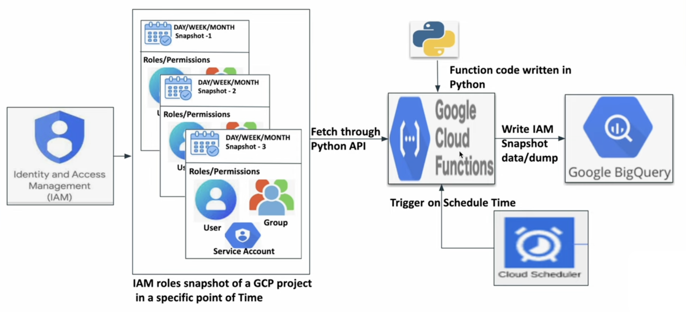

# Project 1 - Automate GCP Project’s IAM Roles Snapshot process using Cloud Functions, Bigquery, Cloud Scheduler

1. Cloud Function
    Name: iam_snapshot_cf

2. Cloud Scheduler
    Name: scheule_iam_snapshot
    region:
    frequency: 09**1        # Every Monday at 09 AM.
    timezone: utc
    url: <cloud function trigger url>
    target type: http
    http method: post

3. BigQuery
    Dataset
    Table --> iam_roles_snapshot
            schema: role STRING; members STRING REPEATED; snapshot_time STRING  

        WITH analysis as (
            SELECT
            SPLIT(role, '/)[OFFSET(1)] AS role,
            SPLIT(members, ':')[OFFSET(0)] AS user_type,
            SPLIT(members, ':')[OFFSET(1)] AS user,
            snapshot_time
            FROM `my_project_1234.gcp_dataset.iam_roles_snapshot`
            UNSET(members) as members
        )
        SELECT * FROM analysis
        WHERE user = 'mayank@gmail.com'

    