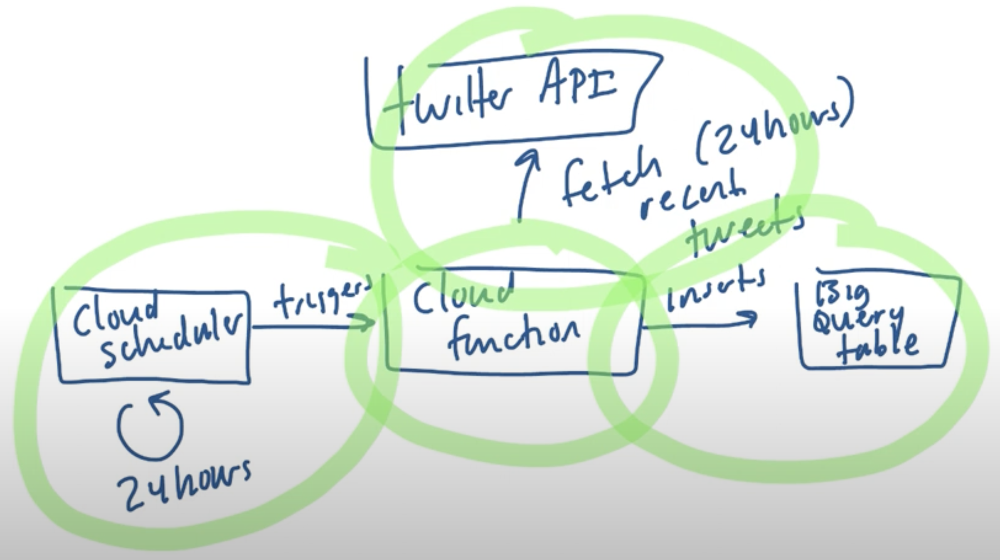

# Use Cloud Scheduler to Trigger a Cloud Function that inserts Data into BigQuery

Flow and Architecture --> 

1. Big Query - Dataset and Table
2. Cloud Function
3. Cloud Scheduler
    Name: periodic_tweet_fetcher
    Region: us-central1
    Frequency: *****    # Every Minute
    Timezone: utc
    Configure the execution: 
        Target Type: HTTP
        URL: <Get the Trigger URL from Cloud Function > TRIGGER >
        HTTP method: GET
        Auth header: Add OIDC token.
        Service Account: Create a new SA with  role: Cloud Functions Invoker
        Audience: <could use same Trigger URL>
    Create
    