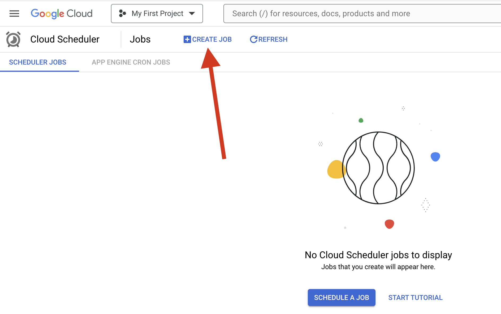
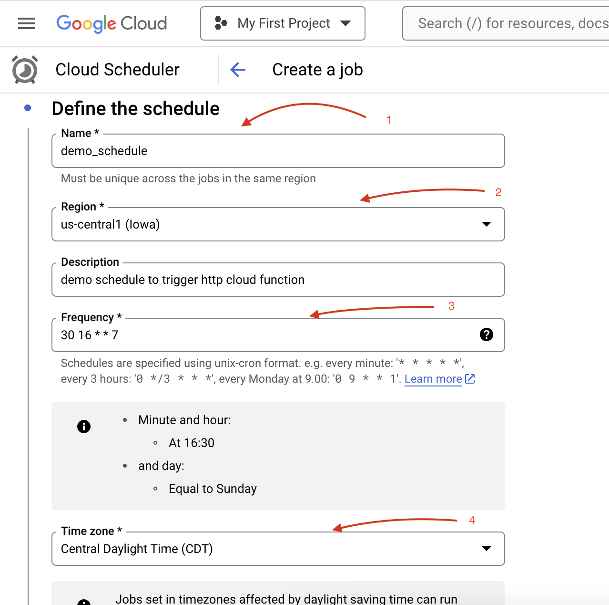
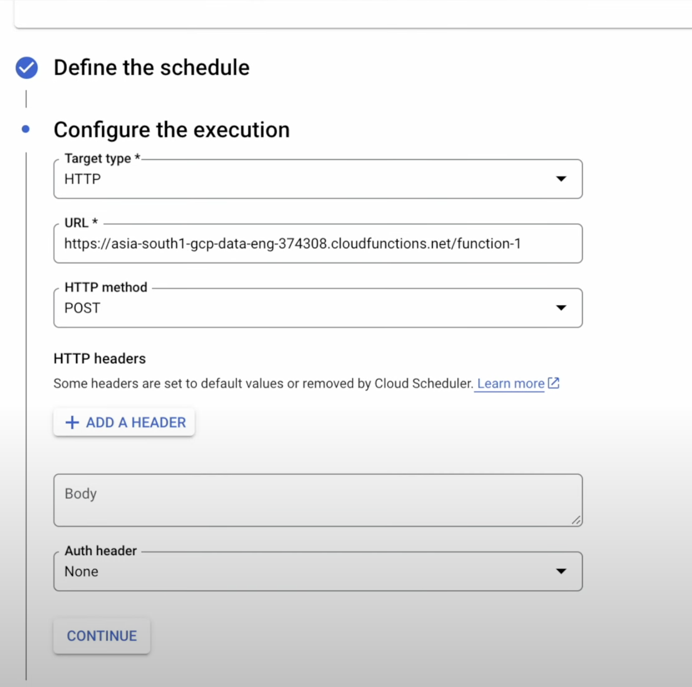
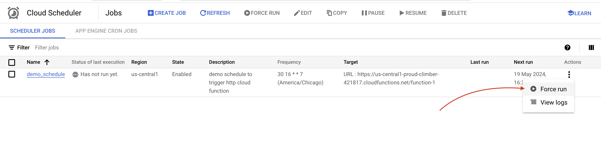

# Cloud Scheduler
1.  Fully Managed CORN job scheduler.
2. Schedules any jobs like Big Data, Cloud Infrastructure Operations, and automating tasks.
3. Each schedule job will be sent to a target where the actual task is accomplished.
4. Supports 3 target types.
    * Publically available HTTP endpoint
    * Pub/Sub Topic
    * App Engine HTTP Apps

# Demo 1: Corn Job to schedule and trigger the Cloud Function.
First will go configuring this via Cloud Console.
    Integration Services > Cloud Scheduler

    

    

    One of the field is Frequency --> It uses Corn Expression.
    A cron expression is a string comprising five or six fields separated by white space that represents a set of times, normally as a schedule to execute some routine.

    For example, 
    
    * Using `* * * * *` will run every minute. 
    * Using "* * * * 1" will run every minute only on Monday. 
    * Using six asterisks means every second when seconds are supported.

    [Get more details](https://en.wikipedia.org/wiki/Cron#:~:text=Asterisks%20(also%20known%20as%20wildcard,second%20when%20seconds%20are%20supported.) 

    
    Make sure to have the Cloud Function URL.

    FOr now the Cloud Function is using Python and default code.

    Rest all for now keeping as default, and hit create the Cloud Scheduler.

    We can run the Schedul forcefully or wait for its schedule.

    

# Demo 2: Corn Job to schedule and trigger the Pub/Sub Topic.

