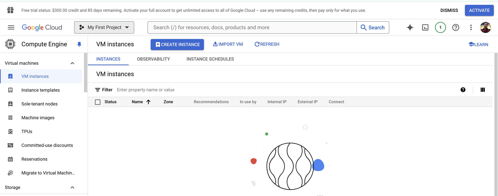
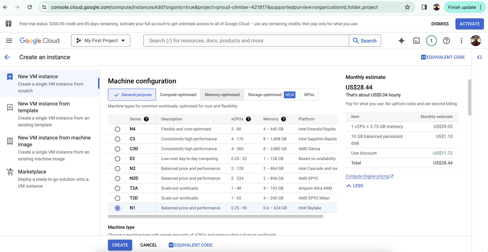

# What is a Compute Engine in GCP?
Compute Engine is a secure and customizable compute service that lets you create and run virtual machines on Google’s cloud infrastructure called GCP. 
Google Compute Engine is the Infrastructure as a Service component of Google Cloud Platform. 
Compute Engine provides tools to help you bring your existing applications to the cloud infrastructure. 
You can have your applications running on Compute Engine within minutes while your data migrates transparently in the background. Also, you can migrate your applications with its OS running on physical servers, VMware vSphere, Amazon EC2, or Azure VMs

# Prerequisites for creating a VM on GCP
* As the system administrator or DevOps administrator, the user should be able to create a virtual machine and have enough permission to working with it on the GCP console
* The Google Cloud Platform uses projects to manage resources. To use Google Compute Engine, you should have an existing project or can create a new one
* Google Compute Engine requires billing to be enabled for the project you use. The user has to set up by creating a new billing account
* The user has to set up his billing profile, by setting up his company profile, payment method and enable the billing profile

# Enabling Compute Engine in GCP
Choose the project, where you want to create the VM, and Enable compute engine API

Before creating your VM on your specified project in GCP, you need to enable the compute engine API on your GCP console. 
Enable this API by navigating to **API and services → Library → Compute → Compute Engine API → Enable API**

# Ways of creating a VM
There are 4 ways of creating a VM in Google Cloud.
1. New VM Instance – Creating a single VM instance from scratch
2. New VM Instance from template – Creating a new instance from the existing template
3. New VM instance from machine image – Creating a new instance from the existing machine image. A machine image lets you store the configuration, metadata, and data disks required to create a VM instance
4. New VM Instance from the MarketPlace – Deploy a new instance from the Market Place area where you can choose the image with applications you want to run on the instance

# How to create a virtual machine in Google Cloud Platform via Browser / Console (New VM Instance)
The key component of cloud-based computing is the virtual machine.   

In any cloud computing service like Google Cloud Platform, it does not matter whether you are deploying a storage server, database, or application development environment; whatever infrastructure it is will start with a VM. Creating a VM using Google Cloud Platform is relatively simple, but there are some strategies to consider and decisions to be made.

For our use-case, we are going to assume you already have an active and authorized administrative account on Google Cloud. We are going to create a New VM instance to explore all available options to create a VM instance.

Logon to GCP and go to the console page. 
Choose **Compute Engine → VM instances → Create Instance**

Using the left-hand navigation bar, click Compute Engine and then select VM instances from the item list. If this is your first VM on the platform, you should see a screen similar to below.

If you have a VM template you can import it to GCP, but in this case we will create a VM from scratch. 

Click the Create button to get started. You might see there are several choices to make. 

On expanding the New VM Instance page, you will be asked to 
    * Provide Name, 
    * Machine Configuration, 
    * CPU configuration, 
    * Firewall, 
    * Security, 
    * Disk, and 
    * Storage configuration. 
These details are covered in the following steps.

The first is to choose a permanent name (Instance Name) for your VM. This should be identifiable to you and your organization. Names must start with a lowercase letter followed by up to 62 lowercase letters, numbers or hyphens, and cannot end with a hyphen.

Note that the server Region and Zone where your VM will be deployed is also permanent, so careful consideration should be given to its physical location. Closer to your office’s location is generally better. On the right, you will also see an estimate of your current VM configuration’s cost.
* A region is a specific geographical location where you can run your resources. You can choose the region from the available list, which is nearer to your geographic region.
* A zone is an isolated location within a region. The zone determines what computing resources are available and where your data is stored and used. You can choose the available zone from the available list. Each region has three or four zones.

As you scroll down, the next section will be **Machine configuration**. 
* General purpose VMs are useful for lower workload operations. 
* Higher workloads like for databases will require memory optimized VMs. 
Choices under Series refers to the class of virtualized CPU—N1 is less powerful and therefore less expensive than N2.

* Machine Family – Based on your requirements, you can choose either General Purpose or Memory Optimized machine types. Each family has its series of CPU platforms either be a First Generation ( N1 ) families or Second Generation ( E2 ) families

* Machine Type – Based on vCPU and Memory GCP classified machine types into various categories like shared core, standard, high CPU, and higher categories. You can choose the machine type depending on the workload and memory consumption of your application running on the VM.

We also have option to customize the machine type may be like set for 3 vCPU's and 3 GB or so.

GCP also provide option to select CPU Platform and GPU (for selected classes of machine). Default is "Automatic".
CPU Platform – The microarchitecture of your VM instance. Select ‘Automatic’ unless you have a specific need.

Next we have **Display device** option, which will enable us to use screen capturing and recording tools. (We can turn ON or OFF the display device setting. You can turn on a display device if you want to use screen capturing and recording tools, else it could be OFF.) [Refer here for more details on Display Device](https://helpcenter.itopia.com/en/articles/3658630-virtual-display-devices-on-virtual-machines-in-gcp).

Confidential VM service – This service adds protection to your data in use by keeping the memory of this VM encrypted with keys that Google doesn’t have access to. This service is bound to a particular series of machine types, regions, and zones.

Continuing to scroll down the page, you can choose whether to deploy a container image on your VM. Containers are useful for development environments and other special circumstances—if you need a container, enable it here.
You can deploy a container to this VM instance by using a container-optimized OS image. By deploying containers on Compute Engine, you can simplify app deployment while controlling your VM infrastructure. Alternatively, you could use the Google Kubernetes Engine. For a simple VM launch, you don’t need to enable this option.

The next section "Boot disk" asks you to choose an operating system for your VM. Clicking the Change button will give you access to several OS choices (from the list of OS's which contains CentOS, Fedora, Debian, RHEL, SuSE Enterprise Linux, Ubuntu, and Windows Server), mostly sticking to variations of Linux. Each one of those OS choices has separate versions available. Choose the OS and version that best fits your VM needs.
Each instance requires a disk to boot from. Select an image or snapshot to create a new boot disk or attach an existing disk to the instance. Generally, this boot disk selection will choose the OS you want to run on the VM. 

The next section (Identity and API access) asks questions about access, allowed APIs and firewall configurations. You can specify access to your VM to a specific individual or group or open it to the entire organization. The APIs made available to the VM will be determined by its overall function. Application development will likely require more API access, not less.
This section allows applications running on the VM to use the service account to call Google Cloud APIs. You can select the service account that you want to use and the level of API access that you want to allow. Applications running on the VM use the service account to call Google Cloud APIs. Use Permissions on the console menu to create a service account or use the default service account if available.

Access scopes – Select the type and level of API access to grant the VM. There are three types of access scopes available, you can choose any one of them.

    * Allow default access
    * Allow full access to all Cloud APIs
    * Set access for each API

Default access will grant → read-only access to Storage and Service Management, write access to Stackdriver Logging and Monitoring, read/write access to Service Control

Firewall – By default, all incoming traffic from outside a network is blocked. Select the type of network traffic that you want to allow. You can enable or disable HTTP or HTTPS traffic depending on your policy or requirement.
The firewall settings will determine whether your VM will be accessible via internet protocols HTTP and HTTPS.

Optionally we have Advanced Configuration, where you have advanced configuration tabs / sections on the next step, namely 

* Management
    * Deletion protection – You can enable or disable this deletion protection option. When deletion protection is enabled, instances cannot be deleted. By enabling deletionProtection, a VM instance can be protected from accidental deletion. If a user attempts to delete a VM instance for which you have enabled the deletionProtection, the request fails. Only a user that has been granted a role with computing instance creation permission can disable the option to allow the resource to be deleted.

    * Automation – This is an optional configuration, here you can set up startup script and metadata to be processed at the booting time of the VM. You can choose to specify a startup script that will run when your instance boots up or restarts. Startup scripts can be used to install software and updates and ensure that services are running within the virtual machine. You can set custom metadata for an instance or project outside of the server-defined metadata. This is useful for passing arbitrary values to your project or instance that can be queried by your code on the instance. You can add the metadata as a new item by inputting the Key and value of the metadata.

* Security configurations
    * Shielded VM – Shielded VM features include trusted UEFI firmware and come with options for Secure Boot, vTPM, and Integrity Monitoring.
    * Turn ON secure boot – Secure boot helps protect your VM instances against boot-level and kernel-level malware and rootkits.
    * Turn on vTPM – Virtual Trusted Platform Module (vTPM) validates your guest VM pre-boot and boot integrity and offers key generation and protection
    * Turn on Integrity monitoring – Integrity monitoring lets you monitor and verify the runtime boot integrity of your shielded VM instances using Stackdriver reports.
    Note: requires vTPM to be enabled.

    * SSH Keys – These keys allow access only to this instance you created. Also, you can enable the option “Block project – wide SSH Keys”. By creating and managing SSH keys, you can let users access a Linux instance through third-party tools also. If a user presents their private SSH key, they can use a third-party tool to connect to any instance that is configured with the matching public SSH key file, even if they aren’t a member of your Google Cloud project. Therefore, you can control which instances a user can access by changing the public SSH key metadata for one or more instances.

* Disk configurations
    * Additional Disks – Additional disks provide persistent and local SSD storage for the instance. You can add a new disk by clicking on the button “Add new disk” or can attach your existing disk by clicking on the button “Attach existing disk”

* Networking configuration
    * Network Interfaces – Each VM has a minimum of one Network Interface to connect outside the network or internet depending on your firewall configuration. By default, while creating a VM Google’s compute environment provides a single Network Interface to it. To create another network interface you need to have a new network first and can add Network Interface and IP to it.

Now we mostly covered all the configuration options for creating a VM in the Google Cloud Platform console.
When you are satisfied with your choices, click the Create button located at the bottom of the configuration screen. 
The creation and deployment process will take a minute or two. After following these steps you now have an active VM listed on your Google Cloud Platform console page.

