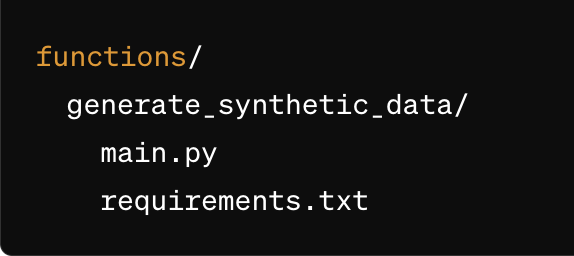

# End-To-End data pipeline using Terraform on Google Cloud Platform
Creating an end-to-end data pipeline using Terraform on Google Cloud Platform involves several steps. You'll need to create resources such as Cloud Scheduler, Cloud Functions, Pub/Sub topics, Dataflow jobs, and BigQuery tables. Here's a detailed guide to help you with the setup.

## Step 1: Set Up Your Terraform Project
1. Install Terraform: Ensure you have Terraform installed on your machine.
2. Create a new directory: This will hold your Terraform configuration files.

    mkdir terraform-gcp-pipeline
    cd terraform-gcp-pipeline

## Step 2: Create terraform files.
    This is the main configuration file where we define all our GCP resources.
    ```
    - main.tf -- Left blank intentionally
    - provider.tf
    - variables.tf
    - pub_sub_topic.tf
    - bigquery.tf
    - bucket.tf
    - cloud_function.tf
    - cloud_scheduler.tf
    - dataflow.tf
    ```

## Step 3: Define the Cloud Function
Create a directory for your Cloud Function code and zip it.

Directory structure:
    

## Step 4: Zip the Cloud Function
Zip the Python function:

```
cd functions/generate_synthetic_data
zip -r ../../generate_synthetic_data.zip .
```

Upload the zip file to the bucket:

`gsutil cp ../../generate_synthetic_data.zip gs://<YOUR_BUCKET_NAME>/functions/`

## Step 4: Alternate Approach
    Modify the "cloud_function.tf" to include data block.
    
## Step 5: Create BigQuery Table Schema
This step remains the same as before.

schemas/customer_schema.json

## Step 6: Initialize and Apply Terraform
Initialize and apply the Terraform configuration.

terraform init
terraform fmt
terraform validate
teraform plan
terraform apply


This will create the Cloud Scheduler, Cloud Function (in Python), Pub/Sub topic, BigQuery dataset and table, and Dataflow job. The scheduler will call the function at the specified interval, generate synthetic data, publish it to Pub/Sub, and the Dataflow job will insert it into BigQuery.

# Conclusion
By following these steps, you can set up an entire data pipeline on GCP using Terraform with a Python Cloud Function. Make sure to replace the placeholder values with your actual project details. This should help you get started with your proof-of-concept.